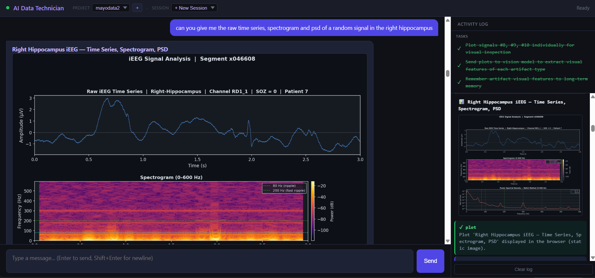
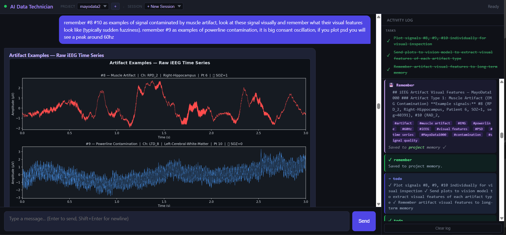
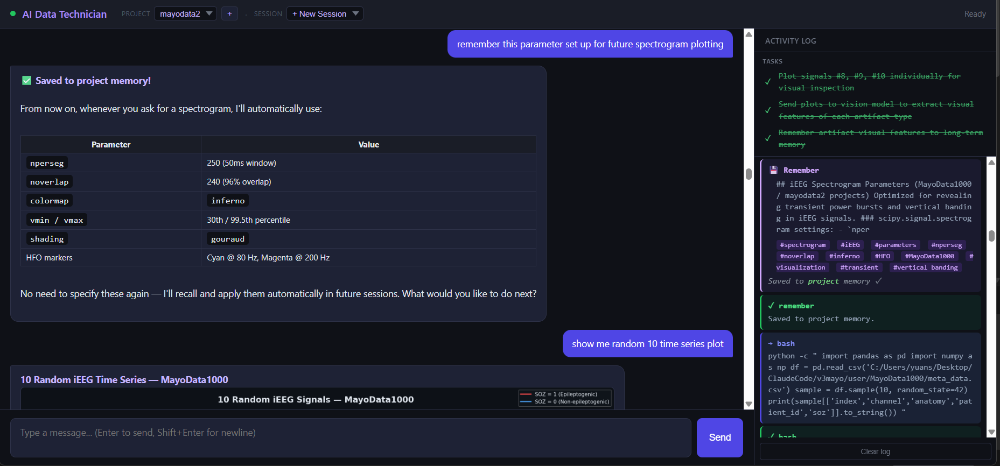
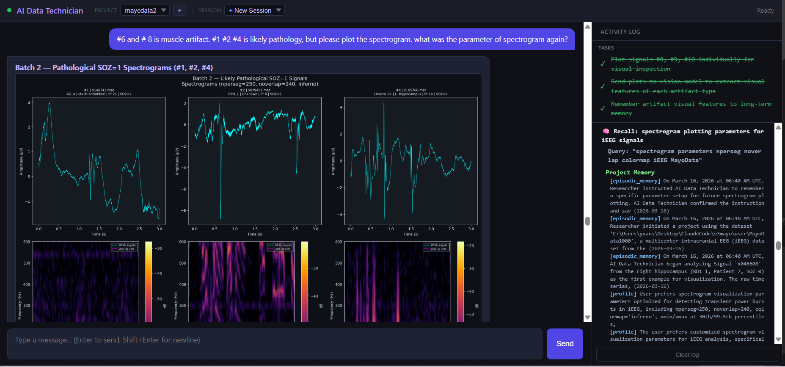
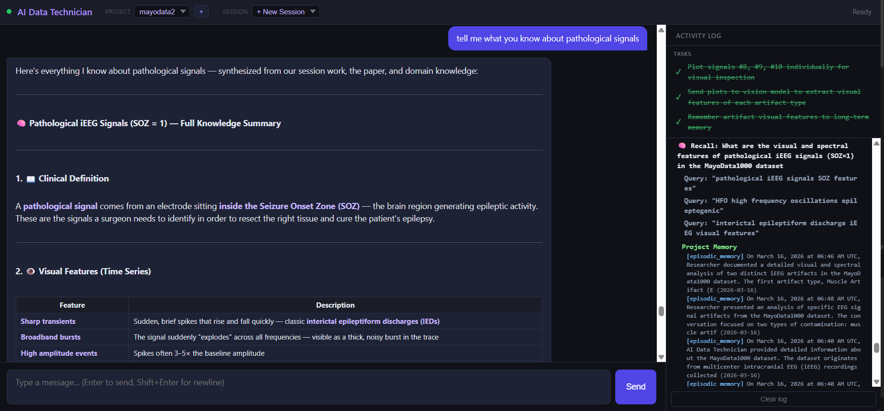

<p align="center">
  
</p>

# AI Data Technician

An agentic AI system that learns from scientist interaction to inspect, analyze, and classify high-dimensional time series data — with persistent memory that improves across sessions.

---

## Motivation

Scientists across neuroscience, physiology, and sensor engineering routinely work with high-dimensional, high-sample-rate time series — multi-channel neural recordings at 1-2 kHz, wearable sensor streams, industrial vibration data. Raw samples exceed both human inspection capacity and LLM context windows, yet the core tasks (artifact rejection, event marking, signal classification) all demand domain expertise applied at scale. No universal thresholds exist — what counts as "muscle artifact" or "clean signal" varies by hardware, brain region, patient population, and analytical goals.

This system bridges the gap by converting raw time series into intermediate representations (spectrograms, PSD plots, statistical features) that both humans and LLMs can reason about, then using interactive human-AI collaboration to formalize expert knowledge into interpretable detection rules. Persistent memory ensures that learned parameters, signal patterns, and processing procedures carry across sessions, creating a system that improves with every interaction.

---

## Features

### Three-Agent Architecture

The system runs on three specialized agents that coordinate to plan, execute, and learn:

**Orchestrator Agent** — The decision-maker. Powered by Claude Sonnet with extended thinking (4,000-token reasoning budget), the Orchestrator receives each user message, reasons about what needs to happen, and decides whether to call a tool directly, delegate to the Task agent, or respond. It maintains the full conversation context, manages the tool-use loop (up to 25 iterations for complex requests), and decides when to recall from memory or save new knowledge. Extended thinking gives it a private scratchpad to plan multi-step analyses before acting — for example, deciding which signals to sample, what statistics to compute, and how to present results, all before making the first tool call.

**Task Agent** — The workhorse. When the Orchestrator encounters multi-step work — exploring a dataset, running a statistical analysis across dozens of files, generating and testing code — it delegates to the Task agent. The Task agent gets a fresh context with its own tool-use loop (up to 15 iterations) and access to `bash`, `read`, `write`, and `vision`. It works autonomously: loading files, computing features, writing results, and returning a final summary. Because it runs independently, the Orchestrator can continue reasoning about the bigger picture while the Task agent handles the details. The Orchestrator injects all necessary context (file paths, column names, data formats, prior findings) into the task description so the Task agent can work without access to the conversation history.

**Think Agent** — The knowledge keeper. A single-pass reasoning agent (no tools) with a 3,000-token thinking budget, the Think agent handles three critical functions:
1. **Memory extraction** — Every 5 user messages, the Think agent reviews recent conversation turns and updates `project_memory.md` with new findings, pruning stale facts and consolidating to stay under 5,000 tokens.
2. **Context compaction** — When the conversation exceeds 40,000 tokens, the Think agent summarizes the oldest 20 turns into a ~200-word paragraph that preserves key findings, metrics, and decisions. This keeps the context window fresh without losing information.
3. **Session reflection** — When a session ends, the Think agent reviews the full conversation and promotes reusable procedures, user preferences, and cross-project insights to global memory.

### Tools

| Tool | What it does |
|------|-------------|
| `bash` | Execute Python scripts, shell commands, or install packages via PowerShell (Windows) or shell (Unix). Supports timeouts and environment variable injection. |
| `read` | Read text files with optional offset/limit paging. Extracts text from PDFs (via PyMuPDF) and loads MATLAB `.mat` files (v4 through v7.3 via scipy and h5py), returning structure and shape information. |
| `write` | Create or update files inside the project directory. Path-restricted — refuses to write outside the project boundary. |
| `vision` | Send one or more images (up to 5) to Gemini Flash for structured analysis. Supports single-image description and multi-image comparison with named references. The system injects project memory into the vision prompt so the model can reference known patterns and parameters. |
| `plot` | Generate charts displayed in the browser. Two modes: **Plotly (interactive)** — code produces a figure dict printed as JSON, rendered as a zoomable/pannable chart with hover tooltips. **Matplotlib (static)** — code creates figures normally; a preamble auto-applies dark theme and an epilogue captures all open figures as base64 PNG, displayed inline with a lightbox. |
| `recall` | Search long-term memory across both project and global layers. Three-phase process: (1) retrieve matching memories via keyword + semantic search, (2) emit results to the UI, (3) synthesize findings through the Think agent into a coherent summary that distinguishes project-specific vs. cross-project knowledge. |
| `remember` | Explicitly save knowledge to long-term memory. Stores content with descriptive tags for future retrieval. Supports `project` scope (dataset-specific) or `global` scope (cross-project). In hybrid mode, writes to both file and EverMemOS simultaneously. |
| `task` | Delegate multi-step work to an autonomous Task agent. The orchestrator packs all necessary context into the description — the Task agent cannot see the conversation. Useful for exploration, statistical analysis, code generation, and evaluation. |
| `ask` | Pause execution and ask the user a clarifying question via a browser modal. The agent waits (up to 10 minutes) for the user's response before continuing. Used only when genuinely blocked. |
| `todo` | Create or update a structured task list for the current session. Each item has an ID, description, and status (`pending` → `running` → `done`/`failed`). Evidence from tool output is mandatory for marking items done or failed — no reasoning-only completions. |

**Pre-installed scientific stack:** NumPy, SciPy, pandas, scikit-learn, MNE, antropy, ruptures, h5py, mat73, matplotlib, plotly, statsmodels, scikit-image.

### Real-Time Web Interface

The browser-based UI connects via WebSocket for real-time streaming — no polling, no page refreshes.

- **Chat panel** — Messages stream in token-by-token as the agent generates them. Markdown rendered with sanitized HTML (XSS-safe via DOMPurify).
- **Activity panel** — A sidebar showing live tool calls and results as they happen. Color-coded labels distinguish orchestrator tools (blue), sub-agent calls (purple), and results (green). Memory recalls and saves appear with their content.
- **Interactive plots** — Plotly charts open as modals with full zoom, pan, and hover. Matplotlib figures display inline with a lightbox for detailed inspection.
- **Ask modal** — When the agent needs clarification, a question appears in the chat with an input field. The agent pauses until you respond.
- **Todo tracker** — The task list appears at the top of the activity panel, updating in real-time as the agent works through steps.
- **Status indicator** — A colored dot shows connection state (green = connected, amber = agent is thinking).

---

## Memory System

### Why Memory Matters

Without persistent memory, every AI session starts from scratch — re-exploring datasets, re-discovering patterns, re-learning preferences. A scientist who spent 20 minutes teaching the system that `nperseg=512` with 93% overlap produces the clearest spectrograms for their hippocampal recordings would have to repeat that lesson in every new session.

Memory transforms the system from a stateless tool into a self-improving research assistant. After a few sessions, the system knows how to load your data, which parameters work best for your signals, what artifacts look like in your recordings, and what analysis procedures you prefer — and it applies all of this automatically.

### What Gets Remembered

- **Processing parameters** — Spectrogram settings (nperseg, overlap, colormap, normalization), filter configurations, visualization preferences. Stored with rationale and example code so the system can reproduce them exactly.
- **Signal patterns** — Artifact signatures (muscle artifact, powerline contamination, electrode pop), pathological features (HFOs, spike-wave complexes), clean signal characteristics. Each pattern includes example signal IDs, channels, anatomy, and distinguishing features.
- **Procedures** — Analysis workflows, data loading scripts, labeling protocols, classification pipelines. Stored as step-by-step instructions the system can follow in future sessions.
- **Domain knowledge** — Terminology definitions, detection rules, feature engineering approaches, dataset-specific metadata. Built up through conversation with the scientist.

### Three-Layer Architecture

Memory is organized in three layers, each with a different scope and lifetime:

**Layer 1 — Session Memory**
Scope: Current conversation only. Stored as a JSON file (`sessions/session_{id}.json`) containing every chat turn, tool call, tool result, artifact reference, and the current todo list. The session is saved after every turn so nothing is lost if the connection drops. Context carry — a lightweight key-value store — lets the orchestrator pass small facts between tool calls without re-reading files.

**Layer 2 — Project Memory**
Scope: Across sessions within the same project. Maintained as `project_memory.md` — a structured markdown document that the Think agent updates every 5 user messages. Contains dataset descriptions (file paths, formats, column names, sampling rates), analysis findings, parameter choices, and pattern definitions. This file is injected into the orchestrator's system prompt at the start of every turn, giving the agent immediate access to everything learned in prior sessions. Because it's plain markdown, it's human-readable, editable, and git-trackable.

**Layer 3 — Global Memory**
Scope: Across all projects. Stored in `projects/_global/global_memory.md`. Populated by end-of-session reflection — the Think agent reviews the conversation and promotes three categories of knowledge: **reusable procedures** (analysis workflows that apply to any dataset), **user preferences** (formatting choices, communication style, tool preferences), and **cross-project insights** (patterns or techniques discovered in one dataset that generalize). Global memory is also injected into the orchestrator's context, so knowledge earned on one project transfers to the next.

### Memory Lifecycle

```
  User teaches something
         |
         v
  Orchestrator calls `remember` ──────> Stored in project or global memory
         |                                with tags for future retrieval
         v
  Every 5 messages ───────────────────> Think agent auto-extracts findings
         |                                into project_memory.md
         v
  Session ends ───────────────────────> Think agent reflects on full session
         |                                Promotes procedures/preferences/insights
         v                                to global memory
  Next session starts ────────────────> project_memory.md + global_memory.md
                                          injected into system prompt
                                          Agent has full context from day one
```

### How Memory Helps Users

**Session 1:** The scientist asks the system to plot a spectrogram. The system uses default parameters. The scientist says "the frequency bands are washed out — try nperseg=512 with 93% overlap and LogNorm." The system applies the changes, the scientist approves, and the system saves the parameters to memory with rationale and example code.

**Session 2:** The scientist asks for a spectrogram of a different signal. The system recalls the previously optimized parameters from memory and applies them automatically — no re-teaching needed. The scientist can focus on the analysis, not the setup.

**Session 5:** The scientist starts a new project with a different dataset. The system recalls from global memory that LogNorm spectrograms with high overlap work well for neural recordings, and applies similar settings as a starting point — transferring knowledge across projects.

**Session 10:** The scientist asks the system to "check this signal for artifacts." The system recalls artifact definitions from memory — muscle artifact (broadband high-frequency power), powerline contamination (60 Hz harmonic peaks), electrode pop (sharp transients) — and runs detection using previously learned thresholds, without the scientist re-defining any of them.

### Memory Backends

Two storage backends are available, and they can be combined:

**File Backend** — Stores `project_memory.md` as plain markdown. Human-readable, git-trackable, works out of the box with no external dependencies. Retrieval is full-text (returns the entire document). Best for teams that want version-controlled memory alongside their code.

**EverMemOS Backend** — A persistent semantic memory service with hybrid retrieval (keyword matching + embedding-based similarity search). Memories are stored with metadata (timestamps, tags, memory types, group IDs) and retrieved using natural language queries that find conceptually related knowledge, not just keyword matches. Available as a [local Docker container](https://github.com/nicholasgasior/evermemos) or managed cloud service.

**Hybrid Backend** — Writes to both file and EverMemOS simultaneously. File provides durability and git-trackability; EverMemOS provides semantic search. This is the default configuration — you get the best of both backends.

### Memory Quality Control

The memory gate (`orchestrator/memory_gate.py`) controls when and how project memory is updated. Rather than updating memory on every message (which would be noisy), it checks whether enough new information has accumulated since the last update (`MEMORY_UPDATE_INTERVAL * 2` turns). When triggered, it sends recent turns to the Think agent with the current memory document and instructions to merge new findings, prune stale facts, and keep each section under 500 words. The result: memory stays current but compact.

The todo system adds a second quality layer — items cannot be marked as `done` or `failed` without evidence from an actual tool result. This prevents the agent from claiming completion based on reasoning alone, ensuring that memory entries are grounded in real observations.

---

## Demo: iEEG Analysis (MayoData1000)

The following screenshots are from a real analysis session on the [MayoData1000 multicenter iEEG dataset](https://doi.org/10.1038/s41597-020-0532-5) (1,000 intracranial EEG signals, 5 kHz, 3 seconds each, SOZ-labeled).

### 1. Explore — Visualize and inspect signals

The scientist asks for a time series, spectrogram, and PSD of a hippocampal signal. The system loads the `.mat` file, computes all three views, and renders them in the browser.

<p align="center">
  
</p>

### 2. Teach — Identify and document signal patterns

The scientist points out artifact examples. The system analyzes them visually (via vision model) and statistically, documenting the distinguishing features of each artifact type.

<p align="center">
  
</p>

### 3. Remember — Save learned knowledge to memory

After the scientist approves a set of spectrogram parameters or artifact definitions, the system saves them to persistent memory — including parameter values, rationale, and example code.

<p align="center">
  
</p>

### 4. Recall — Apply knowledge in future sessions

In a new session, the scientist asks the system to plot spectrograms. The system recalls the previously optimized parameters from memory and applies them without re-learning.

<p align="center">
  
</p>

The system can also synthesize everything it knows about a signal pattern — combining findings from past sessions, the original paper, and domain knowledge into a comprehensive summary.

<p align="center">
  
</p>

---

## Architecture

```
User (Browser)
    |  WebSocket (real-time streaming)
    v
+----------------+
|  FastAPI Web   |  interface/web.py
|  Server        |  Session & project management
+-------+--------+
        |
        v
+----------------+     +---------------+
| Orchestrator   |---->| Task Agent    |  Up to 15 iterations
| (Claude,       |     | (bash, vision |  autonomous tool-use
|  ext. thinking)|     |  read, write) |
|                |     +---------------+
| Plans &        |
| delegates      |---->  Tools (bash, read, plot, vision, ask, todo)
|                |
|                |---->  Think Agent (reasoning, memory updates, compaction)
+-------+--------+
        |
        v
+----------------------------------------------+
|              Memory Backend                   |
|  File (markdown) | EverMemOS (semantic search)|
|                                               |
|  Session JSON - project_memory - global_memory|
+----------------------------------------------+
```

---

## Quick Start

### Prerequisites

- [Pixi](https://pixi.sh) (conda-based package manager)
- An [Anthropic API key](https://console.anthropic.com/) (Claude)
- A [Google API key](https://aistudio.google.com/apikey) (Gemini Flash, for vision)
- *(Optional)* [Docker](https://docker.com) — for running EverMemOS locally

### Setup

```bash
# Clone and install
git clone git@github.com:yuansui123/AI-Data-Technician.git
cd AI-Data-Technician
pixi install

# Configure API keys
cp .env.template .env
# Edit .env: ANTHROPIC_API_KEY=sk-ant-...  GOOGLE_API_KEY=AIza...

# Launch
pixi run web
# Open http://localhost:8000
```

### CLI Options

```
python main.py [OPTIONS]

--project NAME    Project name (default: "default")
--start           Initialize a new project directory
--port N          Web UI port (default: 8000)
--debug           Log all LLM I/O to logs/
```

### Enabling EverMemOS

```bash
# Local (Docker)
docker run -p 1995:1995 ghcr.io/nicholasgasior/evermemos:latest
# Set MEMORY_BACKEND = "evermemos_local" in config.py

# Cloud
# Add EVERMEM_API_KEY=your-key to .env
# Set MEMORY_BACKEND = "evermemos_cloud" in config.py

# Hybrid (both file + EverMemOS)
# Set MEMORY_BACKEND = "hybrid" in config.py
```

---

## Configuration

All settings in [`config.py`](config.py):

| Setting | Default | Description |
|---------|---------|-------------|
| `ORCHESTRATOR_MODEL` | `claude-sonnet-4-6` | Main orchestrator model |
| `THINK_MODEL` | `claude-sonnet-4-6` | Reasoning & memory model |
| `VISION_MODEL` | `gemini-2.5-flash` | Image analysis model |
| `MEMORY_BACKEND` | `"hybrid"` | `"file"`, `"evermemos_local"`, `"evermemos_cloud"`, or `"hybrid"` |
| `ORCHESTRATOR_THINKING` | `4000` | Extended thinking token budget |
| `TASK_MAX_ITER` | `15` | Max tool-use iterations per task |
| `AUTO_COMPACT_THRESHOLD` | `40000` | Token count triggering compaction |
| `MEMORY_UPDATE_INTERVAL` | `5` | User messages between memory updates |

---

## License

MIT
