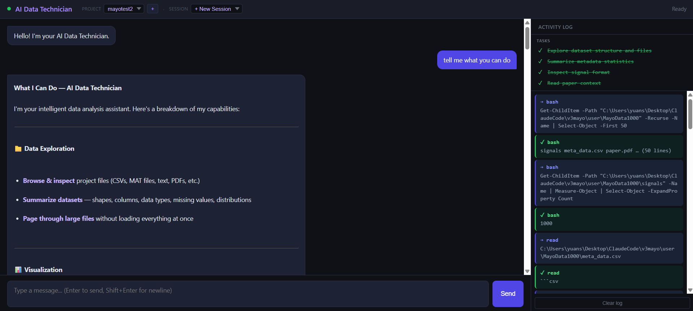

<p align="center">
  
</p>

# AI Data Technician + EverMemOS

An agentic AI research assistant for exploring, analyzing, and building classification rules on datasets — powered by Claude's tool-use architecture, **EverMemOS** for persistent semantic memory, interactive visualization, and a real-time web interface.

Designed for researchers working with biomedical signals (EEG, neural time-series) or any structured data who want AI-assisted pattern discovery — without writing boilerplate code.

<p align="center">
  
</p>

---

## Why EverMemOS?

AI agents forget everything between sessions. Every new conversation starts from scratch — re-exploring datasets, re-discovering patterns, re-learning your preferences. **EverMemOS** solves this.

EverMemOS is a pluggable memory layer that gives AI agents **persistent, semantically-searchable long-term memory**. In this project it serves as the backbone that makes the AI Data Technician genuinely useful across sessions:

- **Episodic memory** — analytical findings, session summaries, labeling history are automatically extracted and stored. When you come back tomorrow, the AI already knows what it found yesterday.
- **Profile memory** — user preferences (preferred plot styles, channel selections, analysis approaches) are learned over time. The AI adapts to how *you* work.
- **Event log** — discrete facts (accuracy numbers, rule strings, file paths) are indexed for fast retrieval. Ask "what accuracy did we get on Rule 3?" and get an instant answer.
- **Semantic search** — memories are retrieved by meaning, not keyword matching. Ask "what did we learn about the hippocampal channels?" and get relevant results even if those exact words were never used.
- **Project-scoped** — each project gets its own memory space (via `group_id`), so findings from one dataset don't leak into another.
- **Cross-project learning** — a global memory layer promotes reusable procedures and insights across all your projects.

### Three Memory Backends

| Backend | Config value | Best for |
|---------|-------------|----------|
| **File** (default) | `"file"` | Getting started — stores `project_memory.md` as plain markdown, human-readable and git-trackable |
| **EverMemOS Local** | `"evermemos_local"` | Full semantic memory — run the [open-source EverMemOS server](https://github.com/nicholasgasior/evermemos) locally via Docker |
| **EverMemOS Cloud** | `"evermemos_cloud"` | Managed service at `api.evermind.ai` — no infrastructure to maintain |

Switch backends with a single line in `config.py`:

```python
MEMORY_BACKEND = "evermemos_local"   # or "evermemos_cloud" or "file"
```

The file backend works out of the box. When you're ready for semantic search, persistent memory across restarts, and automatic knowledge extraction, plug in EverMemOS — the agent code doesn't change at all.

---

## Highlights

**Two-Agent Architecture** — An Orchestrator agent (Claude Sonnet, extended thinking) plans and delegates, while a Task agent autonomously executes multi-step work (bash, vision, file I/O) in up to 15 iterations. Think like Claude Code, but for data analysis.

**Persistent Memory that Actually Works** — Three-layer memory (session, project, global) with automatic compaction and periodic updates. The file backend gives you git-trackable markdown; EverMemOS gives you semantic search and automatic knowledge extraction. The AI never forgets what it learned about your data.

**Interactive Web UI** — Real-time streaming responses via WebSocket, interactive Plotly charts with zoom/pan/hover, static matplotlib plots for scientific figures, and modal dialogs for signal labeling — all in a dark-themed browser interface.

**Rich Tool Suite**
| Tool | What it does |
|------|-------------|
| `bash` | Run Python scripts, shell commands (PowerShell on Windows) |
| `read` | Read text files, PDFs (text extraction), MATLAB `.mat` files (v4–v7.3) |
| `write` | Create/update files inside the project directory |
| `vision` | Analyze single or multiple images via Gemini Flash |
| `plot` | Plotly (interactive) or matplotlib (static PNG, auto-captured) |
| `task` | Delegate multi-step work to an autonomous sub-agent |
| `ask` | Clarifying questions via browser modal |
| `todo` | Structured task tracking with evidence |

**Composable Workflows** — High-level operations like `explore_dataset`, `teach_session` (interactive labeling), `optimize_pattern`, and `apply_rules` chain agents and tools together for complex multi-step analyses.

**Multi-Format Data Support** — Load MATLAB HDF5 (`.mat` v7.3), legacy `.mat` (v4/5/6), CSVs, PDFs, EDF (via MNE), and more. Pre-installed scientific stack: NumPy, SciPy, pandas, scikit-learn, MNE, antropy, ruptures.

---

## Quick Start

### Prerequisites

- [Pixi](https://pixi.sh) (conda-based package manager)
- An [Anthropic API key](https://console.anthropic.com/) (Claude)
- A [Google API key](https://aistudio.google.com/apikey) (Gemini Flash, for vision)
- *(Optional)* [Docker](https://docker.com) — for running EverMemOS locally

### Setup

```bash
# Clone the repo
git clone git@github.com:yuansui123/AI-Data-Technician-EverMemOS.git
cd AI-Data-Technician-EverMemOS

# Install all dependencies (Python 3.11 + scientific stack)
pixi install

# Create your .env file
cp .env.template .env
# Edit .env and add your API keys:
#   ANTHROPIC_API_KEY=sk-ant-...
#   GOOGLE_API_KEY=AIza...

# (Optional) Initialize a named project
pixi run start -- --project MyProject --start

# Launch the web UI
pixi run web
# Open http://localhost:8000 in your browser
```

### Enabling EverMemOS

```bash
# Option A: Local (Docker)
docker run -p 1995:1995 ghcr.io/nicholasgasior/evermemos:latest
# Then set MEMORY_BACKEND = "evermemos_local" in config.py

# Option B: Cloud
# Add to .env: EVERMEM_API_KEY=your-key
# Then set MEMORY_BACKEND = "evermemos_cloud" in config.py
```

### CLI Options

```
python main.py [OPTIONS]

--project NAME    Project name (default: "default")
--start           Initialize a new project directory
--port N          Web UI port (default: 8000)
--debug           Log all LLM I/O to logs/debug_<timestamp>.txt
```

---

## Architecture

```
User (Browser)
    │  WebSocket (real-time streaming)
    ▼
┌──────────────┐
│  FastAPI Web  │  interface/web.py
│  Server       │  Session & project management
└──────┬───────┘
       │
       ▼
┌──────────────┐     ┌─────────────┐
│ Orchestrator │────▶│ Task Agent  │  Up to 15 iterations
│ (Claude,     │     │ (bash,      │  autonomous tool-use
│  thinking)   │     │  vision,    │
│              │     │  read,      │
│ Plans &      │     │  write)     │
│ delegates    │     └─────────────┘
│              │
│              │────▶ Tools (bash, read, plot, vision, ask, todo)
│              │
│              │────▶ Workflows (explore, teach, optimize, apply)
│              │
│              │────▶ Think Agent (reasoning, memory updates, compaction)
└──────────────┘
       │
       ▼
┌──────────────────────────────────────────────┐
│              Memory Backend                   │
│                                               │
│  ┌─────────┐  ┌───────────────┐  ┌────────┐ │
│  │  File    │  │ EverMemOS     │  │ Ever-  │ │
│  │ (markdown│  │ Local (Docker)│  │ MemOS  │ │
│  │  default)│  │ semantic search│  │ Cloud  │ │
│  └─────────┘  └───────────────┘  └────────┘ │
│                                               │
│  Session JSON ─ project_memory.md ─ global   │
└──────────────────────────────────────────────┘
```

### Memory Layers

| Layer | Scope | Storage | EverMemOS enhancement |
|-------|-------|---------|----------------------|
| **Session** | Current conversation | `sessions/session_{id}.json` | Chat turns auto-extracted into episodic memory |
| **Project** | Across sessions | `project_memory.md` | Semantic search over all findings, profiles, event logs |
| **Global** | Across projects | `global_memory.md` | Cross-project pattern recognition and knowledge transfer |

The orchestrator auto-compacts conversation context at ~40k tokens and periodically updates project memory every 5 user messages — so the AI never "forgets" what it learned about your data.

With EverMemOS enabled, memories are automatically categorized (episodic, profile, event), indexed for hybrid retrieval (keyword + semantic), and persisted independently of the markdown files — giving you both human-readable docs and machine-searchable knowledge.

---

## Project Structure

```
AI_Data_Technician/
├── main.py                   # Entry point — argparse CLI, launches FastAPI
├── config.py                 # All models, budgets, paths, API keys
├── pixi.toml                 # Dependencies & tasks
├── .env.template             # API key template
│
├── agents/                   # LLM agent loops
│   ├── runner.py             # Core invoke() engine (streaming, retry, thinking)
│   ├── task.py               # Task agent — autonomous multi-step tool-use
│   └── think.py              # Think agent — single-pass reasoning & memory
│
├── orchestrator/
│   └── loop.py               # Main decision loop + tool dispatch
│
├── tools/                    # Deterministic tools (schemas + implementations)
│   ├── bash.py, read.py, write.py, vision.py, plot.py, ask.py, todo.py
│   └── __init__.py           # Tool registry
│
├── workflows/                # Multi-step composed operations
│   ├── explore_dataset.py    # Analyze structure, stats, sample plots
│   ├── teach_session.py      # Interactive signal labeling
│   ├── optimize_pattern.py   # AI-guided rule refinement
│   └── apply_rules.py        # Batch classification
│
├── memory/                   # Pluggable memory backends
│   ├── backend.py            # Abstract interface + FileMemoryBackend
│   └── evermemos.py          # EverMemOS client (local + cloud)
│
├── session/
│   └── session.py            # Turns, todos, artifacts, context carry
│
├── interface/
│   └── web.py                # FastAPI + WebSocket + embedded HTML/JS
│
├── prompts/system/           # System prompts (injected at runtime)
│   ├── orchestrator.md
│   ├── task.md
│   └── think.md
│
└── projects/                 # User data (per-project)
    └── {name}/
        ├── project_memory.md # Persistent knowledge base
        ├── sessions/         # Conversation history (gitignored)
        ├── feedback/         # User labels (gitignored)
        └── tmp/              # Temp files (gitignored)
```

---

## Usage Examples

**Explore a dataset**
> "Explore the data at C:\path\to\my\data"

The AI will scan file structure, load samples, compute statistics, generate plots, and store findings in project memory.

**Visualize signals**
> "Plot channel 5 from trial 10 of the stim1 epoch"

Generates an interactive Plotly chart (or matplotlib for spectrograms/topomaps) displayed directly in the browser.

**Teach patterns**
> "I want to label some signals"

Opens an interactive labeling session — the AI shows you signals one at a time and you classify them via browser buttons.

**Build classification rules**
> "Find a rule that separates the good trials from the bad ones"

The AI uses the `optimize_pattern` workflow to iteratively refine rules, testing accuracy at each step.

---

## Configuration

All settings live in [`config.py`](config.py):

| Setting | Default | Description |
|---------|---------|-------------|
| `ORCHESTRATOR_MODEL` | `claude-sonnet-4-6` | Main orchestrator model |
| `THINK_MODEL` | `claude-sonnet-4-6` | Reasoning & memory model |
| `VISION_MODEL` | `gemini-2.5-flash` | Image analysis model |
| `MEMORY_BACKEND` | `"file"` | Memory backend: `"file"`, `"evermemos_local"`, or `"evermemos_cloud"` |
| `ORCHESTRATOR_THINKING` | `4000` | Extended thinking token budget |
| `TASK_MAX_ITER` | `15` | Max tool-use iterations per task |
| `AUTO_COMPACT_THRESHOLD` | `40000` | Token count triggering compaction |
| `MEMORY_UPDATE_INTERVAL` | `5` | User messages between memory updates |

---

## Extending

**Add a tool** — Create `tools/mytool.py` with a function + `SCHEMA` dict, register it in `tools/__init__.py`.

**Add a workflow** — Create `workflows/myworkflow.py` with an async function, register in `workflows/__init__.py`.

**Swap memory backend** — Implement the `MemoryBackend` interface in `memory/backend.py` and set `MEMORY_BACKEND` in `config.py`. See `memory/evermemos.py` for a full reference implementation.

---

## License

MIT
